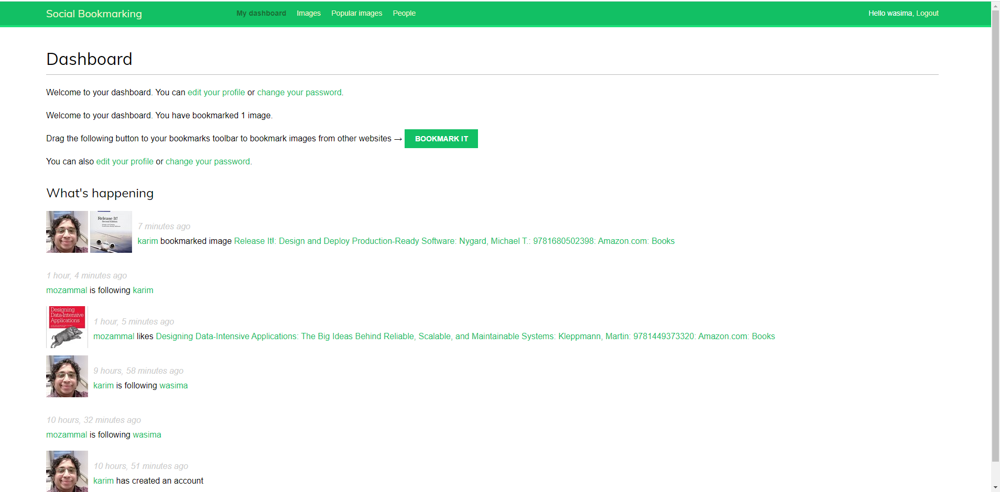
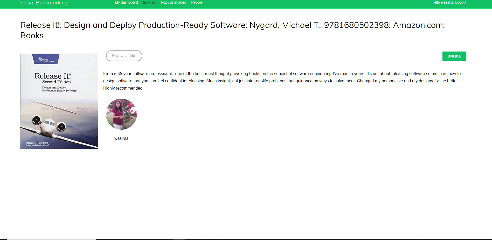

# social-bookmarks

# About

Sample djnago social bookmarking application with mysql, redis, and docker-compose

# Running Locally
The only dependency for running this example is [Docker Compose][docker].

[docker]: https://docs.docker.com/compose/install/

You need to edit the blog.env file to configure an external SMTP server by setting your own values for the environment varibales EMAIL_HOST_USER and EMAIL_HOST_PASSWORD. Once you are ready, you can start the application using the following command:

```sh
$ docker-compose up -d
```

If you want to tear-down the application, use the command written below:

```sh
$ docker-compose down
```

# The Django social bookamrking home page looks as follows:






